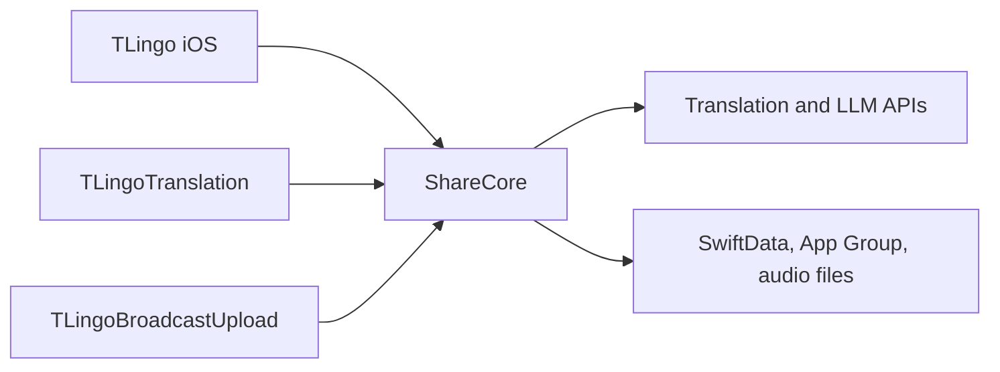

# iOS Architecture

## Target Graph

| Area | Ownership |
| --- | --- |
| `ios/AITranslator/` | App lifecycle, navigation, onboarding, paywall, History and Realtime UI |
| `ios/AITranslator/TextSelection/` | macOS selection capture (AX → browser AppleScript → Cmd+C → menu bar Copy), trigger icon and popup |
| `ios/AITranslator/Screenshot/` | macOS screen region capture and clipboard image OCR entry points |
| `ios/ShareCore/Configuration/` | Actions, models, configuration persistence |
| `ios/ShareCore/Networking/` | Translation, LLM, speech and voice requests |
| `ios/ShareCore/Realtime/` | Audio input, recognition, translation, captions and session state |
| `ios/ShareCore/History/` | SwiftData records, Realtime audio storage, export and post-processing |
| `ios/ShareCore/OAuth/` | Activation, PKCE, token persistence and website restore |
| `ios/ShareCore/UI/` | Shared Home, result, conversation and language components |
| `ios/TranslationUI/` | System translation extension adapter |
| `ios/TLingoBroadcastUpload/` | ReplayKit audio producer |
| `ios/ShareCoreTests/` | Swift Testing and snapshot coverage |

## State Ownership

- `HomeViewModel` owns one translation request generation and all provider runs belonging to it.
- Translation-category requests send `InputTextNormalizer` output (identifier splitting, comment markers, hard-wrap and Apple Books cleanup); the input field keeps the raw text.
- The built-in Translate action switches to `BuiltInActionCatalog.wordLookupPrompt` for LLM runs when `WordLookupDetector` classifies the input as a word or short phrase; direct translation providers are unchanged.
- `OCRTextRecognizer` runs Vision OCR and merges line observations into paragraphs; macOS screenshot, screenshot OCR and clipboard translate hotkeys feed its text into the selection popup.
- `LLMService` routes Worker models through the Worker and Apple Foundation Models through `FoundationModelService`: `apple-foundation-model` runs on-device, while `apple-private-cloud` uses Private Cloud Compute.
- `RealtimeSessionStore` owns one Realtime session generation, shared producer lifecycle, macOS lane configuration and final History snapshot.
- On macOS, `RealtimePipelineCoordinator` owns the shared recognition/translation execution graph. Recognition nodes are keyed by model ID, Azure audio translation is shared, and lane runtimes own independent transcript and translation state.
- FluidAudio adapters normalize Parakeet EOU, English Nemotron and Nemotron 3.5 Multilingual output into stable and pending transcript snapshots for macOS lane fanout and iOS microphone recognition. iOS models download into the app cache when selected.
- `RealtimeR2T2Recognizer` runs Confucius4 R2T2 through `mlx-audio-swift` `Qwen3ASRModel` and produces the same stable and pending snapshots.
- Realtime snapshots may carry stable recognition segments and one pending segment so model EOU boundaries survive Caption, History and LRC rendering.
- A macOS realtime lane may select `None` as its translation provider to publish and persist source transcription without creating a translation node.
- `TranslationHistoryService` owns persistent records and the transaction boundary with external audio files.
- `AppConfigurationStore` owns the active configuration and its persistence.
- `OAuthCoordinator` owns one token state and serializes activation, restore and refresh writers.
- SwiftUI views issue commands and render state; they must not persist whole stale domain snapshots.

## Current Hotspots

- `HomeViewModel`: request generation, provider aggregation and History writes.
- `RealtimeSessionStore`: producer lifecycle, translation scheduling and persistence.
- `RealtimePipelineCoordinator`: multi-lane node sharing, per-lane lifecycle, audio-timeline lag measurement and device-aware resource isolation.
- `TranslationHistoryService`: migration, SwiftData error handling and audio cleanup.
- `HistoryRecordDetailView`: post-processing and live record synchronization.
- `RealtimeFluidAudioRecognizer`: long-session memory and inference cost.

File size alone is not a finding. Refactors must reduce state ownership ambiguity or duplicate behavior behind a smaller interface.
