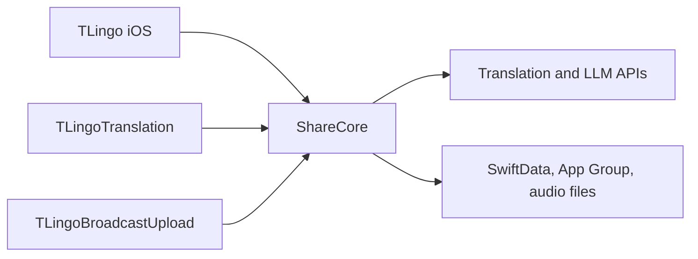

# iOS Architecture

## Target Graph

| Area | Ownership |
| --- | --- |
| `ios/AITranslator/` | App lifecycle, navigation, onboarding, paywall, History and Realtime UI |
| `ios/AITranslator/TextSelection/` | Direct/Helper selection capture (AX → browser AppleScript → Cmd+C → menu bar Copy); permission-free text popup in the App Store app |
| `ios/TLingoHelper/` | Standalone, non-sandboxed macOS selection input; no ShareCore, translation, account or billing dependency |
| `ios/AITranslator/Screenshot/` | macOS screen region capture and clipboard image OCR entry points |
| `ios/ShareCore/Configuration/` | Actions, models, configuration persistence |
| `ios/ShareCore/Networking/` | Translation, LLM, speech and voice requests |
| `ios/ShareCore/Realtime/` | Audio input, recognition, translation, captions and session state |
| `ios/ShareCore/History/` | SwiftData records, Realtime audio storage, export and post-processing |
| `ios/ShareCore/Vocabulary/` | Saved terms and flashcard review state in a separate SwiftData store |
| `ios/ShareCore/OAuth/` | Activation, PKCE, token persistence and website restore |
| `ios/ShareCore/UI/` | Shared Home, result, conversation and language components |
| `ios/TranslationUI/` | System translation extension adapter |
| `ios/TLingoBroadcastUpload/` | ReplayKit audio producer |
| `ios/ShareCoreTests/` | Swift Testing and snapshot coverage |

## State Ownership

- `HomeViewModel` owns one translation request generation and all provider runs belonging to it.
- `AppPreferences.modelListOrder` persists model section order and model IDs within each section in App Group defaults. The default section order is Translation, Free Models, Premium Models, then Apple Intelligence; saved custom orders take precedence. The shared Models page and selection sheet offer native SwiftUI `List.onMove` sorting in one flat list: dragging a group row moves the whole group, and models move only within their own group. `ModelListSections` applies the same order to selection cards and Home's Model List Order results; new models append within their category, and hidden-model visibility rules remain unchanged. Order changes immediately refresh existing results without restarting translation.
- macOS selection popups and menu bar quick translation embed `HomeView` in results-only mode. They share the primary result, expandable model comparison, sentence-pair controls and Result Options footer with Home; the host retains input, consent and request routing. Conversation and replacement actions are supplied by the host when available.
- Translation-category requests send `InputTextNormalizer` output (identifier splitting, comment markers, hard-wrap and Apple Books cleanup); the input field keeps the raw text.
- The built-in Translate action switches to `BuiltInActionCatalog.wordLookupPrompt` for LLM runs when `WordLookupDetector` classifies the input as a word or short phrase; direct translation providers are unchanged. When an AI run uses this fallback, Home shows a word lookup hint with a shortcut to the same Result Options menu offered below the results.
- `OCRTextRecognizer` runs Vision OCR and merges line observations into paragraphs; macOS screenshot, screenshot OCR and clipboard translate hotkeys feed its text into the selection popup.
- macOS external popup input uses `TextPopupRequest`. `PopupURLEventRouter`, installed in `applicationWillFinishLaunching`, consumes popup Get URL events before SwiftUI can activate a window and forwards all other URLs; the newest cold-launch request is held until launch setup finishes. If the router cannot be installed, popup URLs degrade to the regular `tlingo://translate` deep link. Helper sends data only; TLingo owns translation, consent, entitlement checks and History. App Store builds never start Direct selection monitoring, even when old shared preferences enable it.
- PermissionFlow provides permission drag guidance in the App Store app, Direct and Helper. For realtime screen recording authorization, its panel sits directly below the System Settings window, aligns with the trailing permission content area and follows window movement and resizing. App Store realtime guidance disables accessibility trust prompts and offers only the current app bundle as a drag candidate; cross-app selection monitoring remains limited to Direct and Helper.
- Helper (`TLingoLink`) sends popup URLs to the most recently launched compatible TLingo PID, or launches the preferred registered installation in the background. An incompatible running TLingo (Direct or older) yields an update notice instead of a second instance. Popup dismissal uses the original receiving PID and never starts an app.
- Helper shows a non-activating bubble during selection capture and app handoff. Translation delivery waits up to five seconds for the receiving URL handler's reply off the main actor; capture failure/cancellation, permission loss, paused input, launch/delivery errors and login-item failures use the same notice bubble. A handler reply acknowledges receipt, not translation completion.
- `LLMService` routes Worker models through the Worker and Apple Foundation Models through `FoundationModelService`: `apple-foundation-model` runs on-device, while `apple-private-cloud` uses Private Cloud Compute.
- macOS App Store translation requires explicit data-sharing consent before executing an action, including external popup input. The notice names the cloud providers; versioned acceptance requires users who accepted the former Azure-only notice to consent again. Realtime translation currently uses Apple translation rather than the cloud LLM proxy.
- `RealtimeSessionStore` owns one Realtime session generation, shared producer lifecycle, macOS lane configuration and final History snapshot.
- On macOS, `RealtimePipelineCoordinator` owns the shared recognition/translation execution graph. Recognition nodes are keyed by model ID, and lane runtimes own independent transcript and Apple translation state.
- FluidAudio adapters normalize Parakeet EOU, English Nemotron and Nemotron 3.5 Multilingual output into stable and pending transcript snapshots for macOS lane fanout and iOS microphone recognition. iOS models download into the app cache when selected.
- `RealtimeR2T2Recognizer` runs Confucius4 R2T2 through `mlx-audio-swift` `Qwen3ASRModel` and produces the same stable and pending snapshots.
- Realtime snapshots may carry stable recognition segments and one pending segment so model EOU boundaries survive Caption, History and LRC rendering.
- A macOS realtime lane may select `None` as its translation provider to publish and persist source transcription without creating a translation node.
- `TranslationHistoryService` owns persistent records and the transaction boundary with external audio files.
- `VocabularyStore` owns saved terms in `Vocabulary.store`, apart from the History store so neither schema migrates the other. Entries are unique per normalized term and target language; Home offers saving for successful translation-category results without images.
- `AppConfigurationStore` owns the active configuration and its persistence.
- `OAuthCoordinator` owns one token state and serializes activation, restore and refresh writers.
- SwiftUI views issue commands and render state; they must not persist whole stale domain snapshots.

## Current Hotspots

- `HomeViewModel`: request generation, provider aggregation and History writes.
- `RealtimeSessionStore`: producer lifecycle, translation scheduling and persistence.
- `RealtimePipelineCoordinator`: multi-lane node sharing, per-lane lifecycle, audio-timeline lag measurement and device-aware resource isolation.
- `TranslationHistoryService`: migration, SwiftData error handling and audio cleanup.
- `HistoryRecordDetailView`: post-processing and live record synchronization.
- `RealtimeFluidAudioRecognizer`: long-session memory and inference cost.

File size alone is not a finding. Refactors must reduce state ownership ambiguity or duplicate behavior behind a smaller interface.
